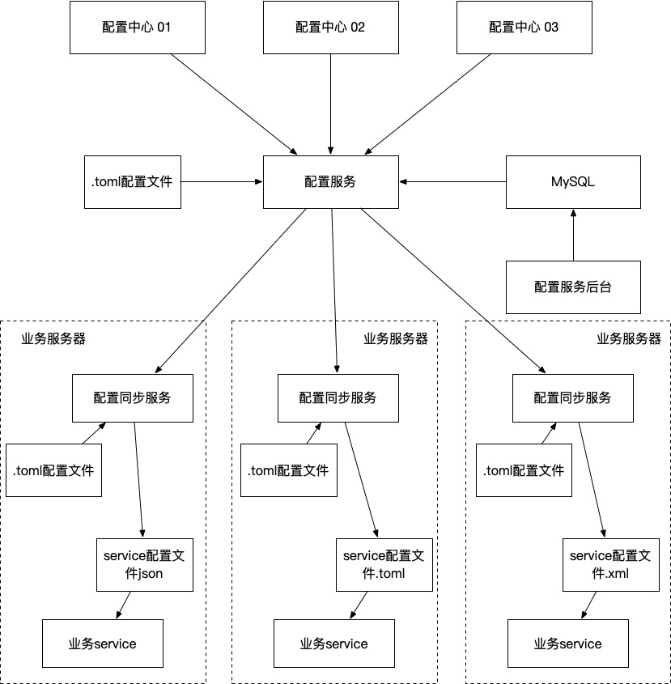

conf-manage 配置中心服务
===
## 架构设计图

## 架构说明
### 设计目的
将应用服务的配置与配置中心进行解偶合，降低服务之间的依赖性

### 适用场景
+ 不同部门有自己不同的配置中心，业务需求同时读取多个配置中心的配置
+ 配置中心使用的配置格式和业务使用的配置格式不统一，比如配置中心为json，业务用xml
+ 配置中心中配置文件名称与服务配置文件名称不统一，比如A部门配置名称为address，B部门程序默认名称为addr，B部门一程序需要读取A部门配置文件
+ 配置中心IP/host经常更换，每次都要修改业务配置中心地址，导致业务经常重启降低业务可用性

### 配套说明
此服务与conf-sync-service共同搭配使用，项目地址
+ 配置服务 [conf-manage](https://github.com/caoshuyu/conf-manage)
+ 配置同步服务 [conf-sync-service](https://github.com/caoshuyu/conf-sync-service)

### 组件说明
#### 配置中心
支持多种配置中心
+ ETCD
+ Nacos
#### 配置服务
+ 通过读取.toml配置文件，获取配置服务的MySql服务器地址和用户名密码信息
+ 通过MySQL获取在配置服务后台所配置的配置中心信息，读取配置后会检测所配置的服务是否正常启动，如果没有正常启动则会打印错误日志
+ 配置服务可以通过数据库中的配置将多个配置中心的配置信息进行合并，并且可以转换成不同的配置文件格式，支持json，toml，xml
+ 配置服务动态监听/定时更新所读取的配置信息，将有变动的信息下发给配置同步服务器，配置同步服务器更新本地配置文件
+ 配置服务对配置文件内的字段可以做映射处理，更改下发配置文件字段名称
+ 配置服务对配置文件中的特定字段可以进行屏蔽，也可以根据已有配置文件信息生成新的配置文件，用户可自行配置配置文件内容格式，更改层级等操作
#### 配置同步服务
+ 通过读取.toml配置文件获取配置服务的地址以及所使用的通信协议
+ 向配置服务获取本地服务所使用的配置文件信息，没有特别声明的则用配置服务设置的配置格式，如果没有配置服务设置的配置格式则使用默认的配置格式
+ 如果为http通信协议，则每5s获取一次配置更新信息，有可能产生最长5s的配置更新延迟
+ 在获取到配置服务的服务更新信息后对服务进行更新通知
+ 每次配置更新保存后会产生版本号，最多单配置可保存50个版本号的设置用于回滚和历史查询操作
#### service配置文件
+ 业务所需要的配置信息
#### 业务service
+ 直接读取配置文件，与配置中心解偶，在业务部署数量较小时可以直接使用文件配置不使用配置中心
+ 使用配置同步服务的时候，如果需要有通知功能，要开发对应的监听接口，可以配置AK，SK，在配置服务时可以配置，最小粒度可以以配置同步服务中所配置的机器名
### 流程说明
1. 用户启动MySQL服务器，导入对应的SQL文件，SQL文件在resources/sql下
2. 配置配置文件，启动配置服务，具体配置见配置说明
3. 启动配置服务后台，在后台中配置配置中心信息
4. 在后台中配置服务配置文件信息，最小粒度可到机器名，配置文件生效优先级：服务名-机器名>服务名
5. 在业务服务器上配置配置同步服务的.toml配置文件，配置基本信息，具体配置见配置说明
6. 启动配置同步服务，获取配置文件信息
7. 启动业务service
8. 除第一次配置外其余机器重复5，6，7三步即可
## 配置说明

##使用说明

